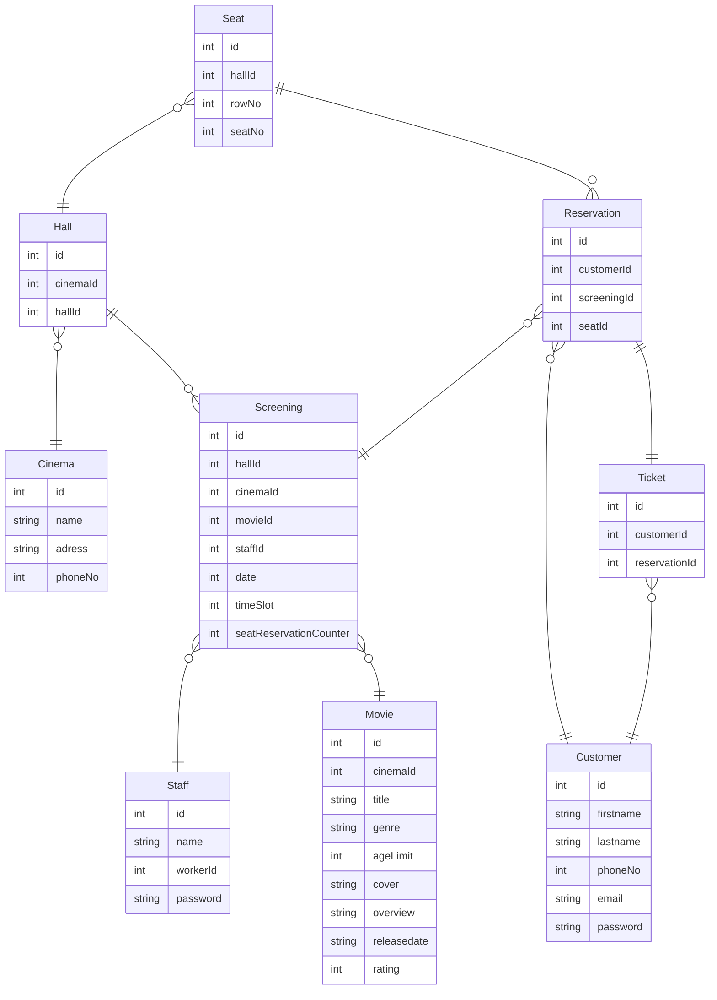

```mermaid
erDiagram
          Seat }o--|| Hall : ""
          Seat ||--o{ Reservation : ""
          Hall }o--|| Cinema : ""
          Hall ||--o{ Screening : ""
          Screening }o--|| Staff : ""
          Screening }o--|| Movie : ""
          Reservation }o--|| Screening : ""
          Reservation ||--|| Ticket : ""
          Reservation }o--|| Customer : ""
          Ticket }o--|| Customer : ""
          Seat {
              int id
              int hallId
              int rowNo
              int seatNo
          }
          Hall {
              int id
              int cinemaId
              int hallId
          }
          Cinema {
              int id
              string name
              string adress
              int phoneNo 
          }
          Ticket {
              int id
              int customerId
              int reservationId
          }
          Reservation {
              int id
              int customerId
              int screeningId
              int seatId
          }
          Screening {
              int id
              int hallId
              int cinemaId
              int movieId
              int staffId
              int date
              int timeSlot
              int seatReservationCounter
          }
          Staff {
              int id
              string name
              int workerId
              string password
          }
          Movie {
              int id
              int cinemaId
              string title
              string genre
              int ageLimit
              string cover
              string overview
              string releasedate
              int rating
          }
          Customer {
              int id
              string firstname
              string lastname
              int phoneNo
              string email
              string password
          }
```

            
